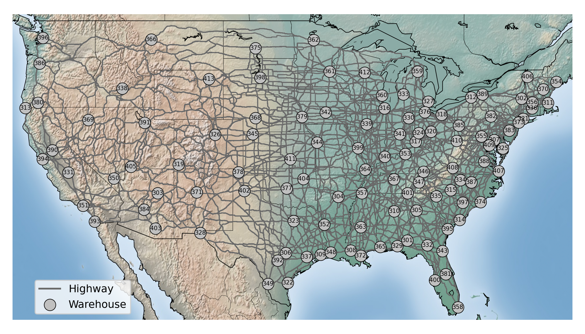

# ARPA-E RECOIL Infrastructure and Demand Data by West Virginia University (WVU)

## Summary

The data contains highway, waterway, and railway nodes and connections in the continental U.S.
<!-- This initiative aims to transform the U.S. transportation sector, a major contributor to greenhouse gas emissions, by developing a low-carbon intermodal freight system to significantly reduce emissions by 2050. This project focuses on innovative models and logistics to enhance energy efficiency and freight resiliency across waterways, rail, and road networks. To perform the mentioned tasks, the following data sources are required: -->

## Updates

- 2025/01/03: `W-adj.pickle` mode changed to 'W'.
- 2024/11/19: edited Seattle port location to be different from the warehouse.
- 2024/11/17: initial publication.

    
## Data files

- URL: [https://recoil.ise.utk.edu/data/Parsed_Data/](https://recoil.ise.utk.edu/data/Parsed_Data/)

## Nodes

### Highway

Highway nodes are collected from the [Freight Analysis Framework (FAF)](https://www.bts.gov/faf) by the U.S. Department of Transportation. Freight origins and destinations are uniformly converted to a "City ST" (ST abbreviates State names) format. In some cases, FAF only provides state-level data and thus "State ST" is used. In total, 113 locations are extracted. Each location is identified using the GIS coordinates of a FedEx facility. The data is at `intermodal-217.csv`, with `id` 301-413.

### Railway

Railway nodes are collected as [Norfolk Southern](https://www.norfolksouthern.com/en/ship-by-rail/our-rail-network/intermodal-terminals-schedules) and [Union Pacific](https://www.up.com/customers/premium/intmap/) intermodal terminals. In total, 56 locations are extracted. Each location is identified using the GIS coordinates of the intermodal facility. The data is at `intermodal-217.csv`, with `id` 101-156.

#### Railway nodes & connections

### Waterway

Waterway nodes are collected as the major U.S. inland and coastal ports. Waterborn tonnage from the [U.S. Army Corps of Engineers](https://usace.contentdm.oclc.org/digital/collection/p16021coll2/id/6753/) and FAF are used to select the locations. In total, 48 locations are extracted. Each location is identified using the GIS coordinates of the inland/coastal port. The data is at `intermodal-218.csv`, with `id` 201-248.

#### Waterway nodes & connections

## Edges

Data for all edges are extracted from the [Freight and Fuel Transportation Optimization Tool (FTOT)](https://volpeusdot.github.io/FTOT-Public/). Highway edges are assumed to connect all highway, railway, and waterway nodes. The U.S. highway network is used to calculate the distances and to construct the paths from one node to another. Railway connections are identified using information from [Norfolk Southern](https://www.norfolksouthern.com/en/ship-by-rail/our-rail-network/intermodal-terminals-schedules) and [Union Pacific](https://www.up.com/customers/premium/intmap/). Railway edges are then constructed using FTOT. Waterway edges are constructed according to the U.S. inland river systems and the east and west coast geographical features.

The highway, railway, and watereay edge data are stored in `H-adj.pickle`, `R-adj.pickle`, and `W-adj.pickle`, respectively, accessible by Python. Each data is formated as a dictionary, where keys are the `id` of origin and destination nodes, e.g., `(1, 2)`. Two way connections are always assumed and smaller index is always the first element in the key. Values contain 7 fields: `i_lat` is the latitude of the origin, `i_lon` is the longitude of the origin, `j_lat` is the latitude of the destination, `j_lon` is the longitude of the destination, `mode` is the mode of transportation, `distance` is the total travel distance from the origin to the destination as miles, `path` is a tuple of all intermediate way points for the path between the origin and the destination.
    

## Demand

The demand data is ectracted from the FAF data using the 113 cities/states as origins and destinations. The data contains projected tonnages in years 2025, 2030, 2035, 2040, 2045, and 2050. Mode-specific tonnages are summed up as the total demand for future research to identify optimal transportation plans, which may deviates from the original projection. The data is stored in `demand.pickle`. The keys are the `id` of origin and destination nodes. Note that keys `(1, 2)` and `(2, 1)` represents two entrires. Values contain 6 fields, including `tons_2025`, `tons_2030`, `tons_2035`, `tons_2040`, `tons_2045`, and `tons_2050`.

### Demand nodes & connections

## Sample Usage 

- See [`usage.ipynb`](usage.ipynb)

# Contact Us

Project Link: <a href="https://recoil.utk.edu/">https://recoil.utk.edu/</a>

